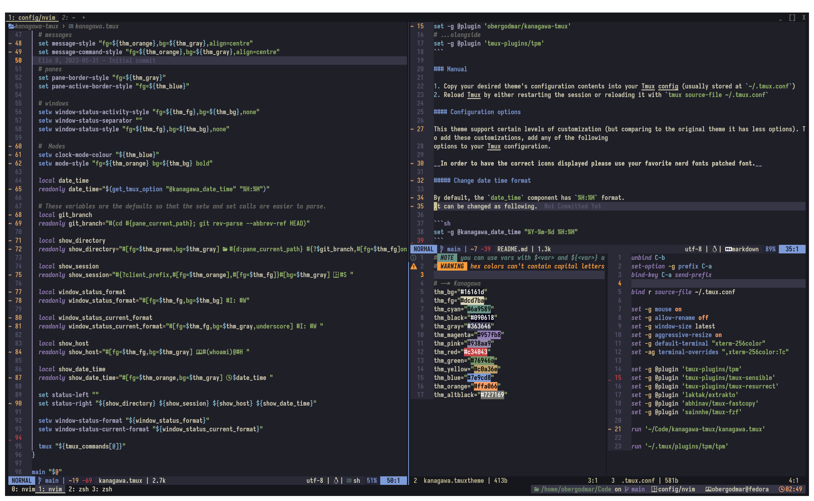

# Kanagawa for tmux
 This is a fork of [eliobtl1/kanagawa-tmux](https://gitlab.com/eliobtl1/kanagawa-tmux) which is a fork of [dreamsofcode-io/catppuccin-tmux](https://github.com/dreamsofcode-io/catppuccin-tmux). It changes the appearance of [eliobtl1/kanagawa-tmux](https://gitlab.com/eliobtl1/kanagawa-tmux) theme and adds some new displayed elements.

## Screenshot :


## Usage

### TPM

1. Install [TPM](https://github.com/tmux-plugins/tpm)
2. Add the kanagawa-tmux plugin:

```bash
set -g @plugin 'obergodmar/kanagawa-tmux'
# ...alongside
set -g @plugin 'tmux-plugins/tpm'
```

### Manual

1. Copy your desired theme's configuration contents into your Tmux config (usually stored at `~/.tmux.conf`)
2. Reload Tmux by either restarting the session or reloading it with `tmux source-file ~/.tmux.conf`

#### Configuration options

This theme support certain levels of customization (but comparing to the original theme it has less options). To add these customizations, add any of the following
options to your Tmux configuration.

__In order to have the correct icons displayed please use your favorite nerd fonts patched font.__

##### Change date time format

By default, the `date_time` component has `%H:%M` format.
It can be changed as following.

```sh
set -g @kanagawa_date_time "%Y-%m-%d %H:%M"
```
